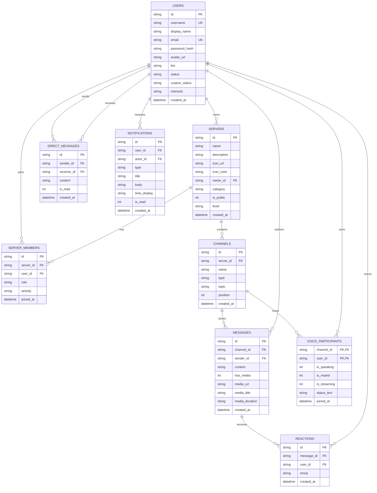

# The Crew — Backend Documentation (Node.js & Socket.io Engine)

> **The Crew Backend** is a high-performance, Discord-like real-time community server built with Node.js, Express, Socket.io, and a pluggable dual database architecture supporting both local **SQLite** (via `better-sqlite3`) and cloud-native **Google Cloud Firestore** (via `firebase-admin`).

---

## Table of Contents
1. [Architecture Overview](#1-architecture-overview)
2. [Dual Database Engine Architecture](#2-dual-database-engine-architecture)
3. [Database Schemas & Data Models](#3-database-schemas--data-models)
4. [Authentication & Security](#4-authentication--security)
5. [Complete REST API Reference](#5-complete-rest-api-reference)
   - [Health Diagnostics](#health-diagnostics)
   - [Authentication & User Management](#authentication--user-management)
   - [Servers & Communities](#servers--communities)
   - [Channels & Chat Messaging](#channels--chat-messaging)
   - [Direct Messages (DMs)](#direct-messages-dms)
   - [Notifications](#notifications)
   - [Voice Channel Audio Stage](#voice-channel-audio-stage)
6. [WebSocket & Real-Time Specifications](#6-websocket--real-time-specifications)
7. [Database Seeder & Test Suite](#7-database-seeder--test-suite)
8. [Configuration & Deployment Guide](#8-configuration--deployment-guide)

---

## 1. Architecture Overview

The backend server is structured as an ES Module (`"type": "module"`) Express application combined with an integrated Socket.io HTTP server instance.

```
                    ┌────────────────────────┐
                    │     Client Devices     │
                    │ (Flutter iOS / Android)│
                    └───────────┬────────────┘
                                │ HTTP & WebSockets
                                ▼
         ┌──────────────────────────────────────────────────┐
         │              HTTP Server (Port 3000)             │
         │  ┌──────────────────────┬──────────────────────┐ │
         │  │   Express REST API   │   Socket.io Engine   │ │
         │  └──────────┬───────────┴──────────┬───────────┘ │
         └─────────────┼──────────────────────┼─────────────┘
                       ▼                      ▼
         ┌──────────────────────────────────────────────────┐
         │            Security & Auth Middleware            │
         │  • JWT Bearer Verification  • CORS Headers       │
         │  • Socket Handshake Auth    • Bcrypt Hashing     │
         └─────────────────────┬────────────────────────────┘
                               ▼
         ┌──────────────────────────────────────────────────┐
         │             Modular Route Controllers            │
         │  • auth.routes        • servers.routes           │
         │  • channels.routes    • dms.routes               │
         │  • notifications      • voice.routes             │
         └─────────────────────┬────────────────────────────┘
                               ▼
         ┌──────────────────────────────────────────────────┐
         │         Database Abstraction Layer (DAL)         │
         │  DB_DRIVER=sqlite       │  DB_DRIVER=firestore   │
         │  (better-sqlite3)       │  (firebase-admin)      │
         └─────────────┬───────────┴──────────┬─────────────┘
                       ▼                      ▼
               ┌───────────────┐      ┌───────────────┐
               │database.sqlite│      │Cloud Firestore│
               │ (Local WAL)   │      │  (Production) │
               └───────────────┘      └───────────────┘
```

### Server Entry Point ([backend/src/server.js](file:///Users/virshin/Downloads/The_crew_flutter_mini_project/backend/src/server.js))
- Creates an HTTP server wrapping Express and attaches `new Server(server, { cors: { origin: '*' } })`.
- Exposes `io` to route handlers via `app.set('io', io)`.
- Mounts middleware: `cors()`, `express.json()`.
- Routes: `/api/auth`, `/api/servers`, `/api/channels`, `/api/dms`, `/api/notifications`, `/api/voice`, and `/api/health`.
- Auto-seeds the SQLite database on startup if empty.

---

## 2. Dual Database Engine Architecture

The Crew backend supports two swappable database drivers controlled by the `DB_DRIVER` environment variable:

| Feature | SQLite Driver (`DB_DRIVER=sqlite`) | Firestore Driver (`DB_DRIVER=firestore`) |
| :--- | :--- | :--- |
| **Driver Package** | `better-sqlite3` | `firebase-admin` |
| **Primary Use** | Local development, unit testing, offline zero-config | Scalable cloud production deployment |
| **File / Adapter** | [src/db.js](file:///Users/virshin/Downloads/The_crew_flutter_mini_project/backend/src/db.js) | [src/db_firestore.js](file:///Users/virshin/Downloads/The_crew_flutter_mini_project/backend/src/db_firestore.js) |
| **Concurrency** | Write-Ahead Logging (`WAL` mode) | Distributed Google Cloud Firestore |
| **Relational Integrity**| Foreign keys (`PRAGMA foreign_keys = ON`) with `ON DELETE CASCADE` | Document denormalization & batch updates |

### Switching the Active Driver
Set in `backend/.env`:
```env
# Use SQLite:
DB_DRIVER=sqlite
DB_PATH=./database.sqlite

# Or switch to Firestore:
DB_DRIVER=firestore
FIREBASE_SERVICE_ACCOUNT_KEY=./serviceAccountKey.json
FIREBASE_PROJECT_ID=the-crew-4da98
```

### Live Cloud Firestore Integration (`the-crew-4da98`)
The backend is fully provisioned and connected to Google Cloud Firestore in project **`the-crew-4da98`**:
- **Service Account Key**: Located at `backend/serviceAccountKey.json` (protected by `.gitignore`).
- **SDK Initializer**: [backend/src/firebase.js](file:///Users/virshin/Downloads/The_crew_flutter_mini_project/backend/src/firebase.js) utilizes modern modular Firebase Admin v14 (`initializeApp`, `cert`, `getFirestore`).
- **Data Migration Status**: All **127 records** across all 9 relational entities (users, servers, channels, messages, reactions, DMs, notifications, voice participants) have been successfully migrated to live Cloud Firestore collections via `npm run migrate:firebase`.

### Data Migration Tooling ([backend/src/migrate_to_firebase.js](file:///Users/virshin/Downloads/The_crew_flutter_mini_project/backend/src/migrate_to_firebase.js))
A complete ETL script migrates all data from local SQLite to Google Cloud Firestore:

```bash
# Dry run (inspect records without writing to Firestore):
npm run migrate:firebase:dry-run

# Execute full migration:
npm run migrate:firebase
```


---

## 3. Database Schemas & Data Models

### Entity-Relationship Diagram



---

## 4. Authentication & Security

### 1. Password Hashing
User passwords are encrypted with `bcryptjs` using a salt work factor of 10 (`bcrypt.hashSync(password, 10)`). Plaintext passwords are never stored.

### 2. JSON Web Tokens (JWT)
Authenticated requests generate signed JWTs via `jsonwebtoken`:
- **Payload**: `{ id: user.id, username: user.username, email: user.email }`
- **Secret**: Set via `JWT_SECRET` in environment variables.
- **Expiration**: 30 days (`{ expiresIn: '30d' }`).

### 3. HTTP Auth Middleware ([backend/src/middleware/auth.js](file:///Users/virshin/Downloads/The_crew_flutter_mini_project/backend/src/middleware/auth.js))
Extracts `Authorization: Bearer <token>`, decodes the payload, and injects `req.user` into downstream route handlers. Unauthenticated requests return `401 Unauthorized` or `403 Forbidden`.

### 4. Socket.io Handshake Auth
The WebSocket server validates tokens during the handshake middleware:
```javascript
io.use((socket, next) => {
  const token = socket.handshake.auth?.token || socket.handshake.headers?.authorization?.split(' ')[1];
  if (token) {
    const decoded = jwt.verify(token, JWT_SECRET);
    socket.userId = decoded.id;
  }
  next();
});
```

---

## 5. Complete REST API Reference

**Base URL**: `http://<host>:3000/api`  
**Default Content-Type**: `application/json`

### Health Diagnostics

#### `GET /api/health`
Inspect server operational status and active database engine.
- **Auth**: None
- **Response `200 OK`**:
```json
{
  "status": "online",
  "platform": "The Crew Backend",
  "database": "sqlite",
  "firebase_ready": false,
  "version": "1.0.0",
  "timestamp": "2026-09-15T10:45:00.000Z"
}
```

---

### Authentication & User Management

#### `POST /api/auth/register`
Register a new pilot account and automatically join default community `s1` (Neon Arcade).
- **Body**:
  ```json
  {
    "username": "valkyrie_7",
    "display_name": "Valkyrie",
    "email": "valk@thecrew.gg",
    "password": "password123",
    "interests": "Gaming,VFX,Tech"
  }
  ```
- **Response `201 Created`**:
  ```json
  {
    "message": "User registered successfully",
    "user": { "id": "u_x89f", "username": "valkyrie_7", "display_name": "Valkyrie", "email": "valk@thecrew.gg", "status": "online", "custom_status": "Ready to squad up" },
    "token": "eyJhbGciOi..."
  }
  ```

#### `POST /api/auth/login`
Authenticate with email or username and password.
- **Body**:
  ```json
  {
    "login": "kaelen@thecrew.gg",
    "password": "password123"
  }
  ```
- **Response `200 OK`**: Returns user profile and JWT token.

#### `POST /api/auth/quick-login`
Instant 1-tap demo login for test accounts (`kaelen_vr` or `nyx_9`).
- **Body**:
  ```json
  { "username": "kaelen_vr" }
  ```
- **Response `200 OK`**: Returns mock user session and JWT token.

#### `POST /api/auth/google`
OAuth token exchange endpoint for Google Sign-In. Auto-creates account if not found and auto-joins `s1`.
- **Body**:
  ```json
  {
    "email": "pilot@gmail.com",
    "display_name": "Google Pilot",
    "photo_url": "https://lh3.googleusercontent.com/...",
    "google_id": "10492837482"
  }
  ```
- **Response `200 OK`**: User profile & JWT.

#### `GET /api/auth/me`
Retrieve profile of currently authenticated user.
- **Auth**: Required (`Bearer <token>`)
- **Response `200 OK`**: `{ "user": { ... } }`

#### `PUT /api/auth/profile`
Update display name, bio, status, or avatar URL.
- **Auth**: Required
- **Body**:
  ```json
  {
    "display_name": "Kaelen [Sector 9 Lead]",
    "bio": "Leading midnight raids.",
    "status": "online",
    "custom_status": "Streaming Sector 9"
  }
  ```
- **Response `200 OK`**: `{ "message": "Profile updated successfully", "user": { ... } }`

---

### Servers & Communities

#### `GET /api/servers`
List all servers the authenticated user is a member of.
- **Auth**: Required
- **Response `200 OK`**:
  ```json
  {
    "servers": [
      {
        "id": "s1",
        "name": "Neon Arcade",
        "description": "The cutting-edge hub for cybernetics and modders...",
        "icon_color": "#9D4EDD",
        "category": "Gaming",
        "level": "LVL 3",
        "my_role": "OWNER"
      }
    ]
  }
  ```

#### `GET /api/servers/discover`
Discover public communities with optional search and category filters.
- **Auth**: None
- **Query Params**:
  - `category` (e.g. `Gaming`, `Music`, `Anime & Art`, `Tech`, `Cozy`)
  - `search` (e.g. `arcade`)
- **Response `200 OK`**: Array of server objects enriched with `member_count` and `online_count`.

#### `POST /api/servers`
Create a new server. Automatically assigns creator as `OWNER` and creates default channels (`#welcome`, `#lounge`, `#media-share`, `Lounge Voice`).
- **Auth**: Required
- **Body**:
  ```json
  {
    "name": "Quantum Drift",
    "description": "Late night racing & sim community",
    "category": "Gaming",
    "icon_color": "#00F0FF",
    "is_public": true
  }
  ```
- **Response `201 Created`**: Returns created server object.

#### `GET /api/servers/:id`
Get detailed metadata for a specific server.
- **Auth**: Required

#### `POST /api/servers/:id/join`
Join a public server as a `MEMBER`.
- **Auth**: Required

#### `POST /api/servers/:id/leave`
Leave a server. Removes member record.
- **Auth**: Required

#### `GET /api/servers/:id/channels`
Fetch text and voice channels for a server, ordered by position.
- **Auth**: Required
- **Response `200 OK`**:
  ```json
  {
    "channels": [
      { "id": "c1", "server_id": "s1", "name": "welcome", "type": "text", "topic": "Rules and guidelines", "position": 0 },
      { "id": "c5", "server_id": "s1", "name": "Chill Beats [Voice]", "type": "voice", "topic": "Spatial audio stage", "position": 4 }
    ]
  }
  ```

#### `POST /api/servers/:id/channels`
Create a new channel inside a server.
- **Auth**: Required
- **Body**:
  ```json
  {
    "name": "synth-releases",
    "type": "text",
    "topic": "Share synthwave tracks"
  }
  ```

#### `GET /api/servers/:id/members`
List members of a server sorted by role (`OWNER` > `ADMIN` > `VIP` > `MEMBER`).
- **Auth**: Required
- **Response `200 OK`**: Array of members with `role`, `activity`, `status`, and profile details.

---

### Channels & Chat Messaging

#### `GET /api/channels/:id/messages`
Fetch messages for a channel with sender details and aggregated emoji reactions.
- **Auth**: Required
- **Response `200 OK`**:
  ```json
  {
    "messages": [
      {
        "id": "m1",
        "channel_id": "c2",
        "sender_id": "u1",
        "content": "Midnight raid lobby is live!",
        "has_media": false,
        "username": "kaelen_vr",
        "display_name": "Kaelen",
        "sender_role": "OWNER",
        "created_at": "2026-09-15 09:41:00",
        "reactions": [
          { "emoji": "🔥", "count": 2, "users": ["u2", "u3"] }
        ]
      }
    ]
  }
  ```

#### `POST /api/channels/:id/messages`
Post a text message or media attachment to a channel. Broadcasts `message:new` via Socket.IO.
- **Auth**: Required
- **Body**:
  ```json
  {
    "content": "Check out this gameplay clip!",
    "has_media": true,
    "media_url": "assets/sector9_clutch.mp4",
    "media_title": "Sector9_Clutch.mp4",
    "media_duration": "01:14"
  }
  ```
- **Response `201 Created`**: Returns created message.

#### `POST /api/channels/messages/:messageId/reactions`
Toggle an emoji reaction on a message (adds if not present, removes if already reacted). Broadcasts `reaction:updated` via Socket.IO.
- **Auth**: Required
- **Body**: `{ "emoji": "🔥" }`
- **Response `200 OK`**: Returns updated reactions array for the message.

---

### Direct Messages (DMs)

#### `GET /api/dms`
Fetch DM conversations and currently online friends ("Active Now").
- **Auth**: Required
- **Response `200 OK`**:
  ```json
  {
    "active_now": [
      { "id": "u2", "username": "nyx_9", "display_name": "Nyx", "status": "online", "custom_status": "Editing clips" }
    ],
    "conversations": [
      {
        "partner_id": "u2",
        "display_name": "Nyx",
        "last_message": "Shared a clip from Sector 9 🎮",
        "last_message_time": "2026-09-15 09:42:00",
        "unread_count": 1
      }
    ]
  }
  ```

#### `GET /api/dms/:userId`
Fetch direct message thread between current user and `:userId`. Automatically marks unread messages as read.
- **Auth**: Required
- **Response `200 OK`**: Returns `{ "partner": { ... }, "messages": [ ... ] }`.

#### `POST /api/dms/:userId`
Send a direct message to `:userId`. Emits `dm:new` to both sender and receiver user rooms.
- **Auth**: Required
- **Body**: `{ "content": "Ready for the tournament?" }`
- **Response `201 Created`**: Returns new DM record.

---

### Notifications

#### `GET /api/notifications`
Fetch notifications for authenticated user, with optional filtering.
- **Auth**: Required
- **Query Params**: `type` (`all`, `mention`, `reaction`, `friend`, `system`, `server`)
- **Response `200 OK`**: Array of notifications with sender details and timestamp.

#### `POST /api/notifications/read-all`
Mark all notifications as read for current user.
- **Auth**: Required

#### `POST /api/notifications/:id/read`
Mark a single notification as read.
- **Auth**: Required

---

### Voice Channel Audio Stage

#### `GET /api/voice/:channelId`
Fetch active participants in a voice channel.
- **Auth**: Required
- **Response `200 OK`**:
  ```json
  {
    "participants": [
      {
        "channel_id": "c5",
        "user_id": "u1",
        "username": "kaelen_vr",
        "display_name": "Kaelen",
        "is_speaking": 1,
        "is_muted": 0,
        "is_streaming": 1,
        "status_text": "Speaking..."
      }
    ]
  }
  ```

#### `POST /api/voice/:channelId/join`
Join voice channel. Broadcasts `voice:joined` via Socket.IO.
- **Auth**: Required

#### `POST /api/voice/:channelId/leave`
Leave voice channel. Broadcasts `voice:left` via Socket.IO.
- **Auth**: Required

#### `POST /api/voice/:channelId/toggle-mute`
Toggle participant mute state. Broadcasts `voice:mute_updated` via Socket.IO.
- **Auth**: Required

#### `POST /api/voice/:channelId/speaking`
Update active speaking status (`{ "is_speaking": true }`). Broadcasts `voice:speaking_updated`.
- **Auth**: Required

---

## 6. WebSocket & Real-Time Specifications

### Room Naming Convention
- **Channel Room**: `channel_<channelId>` (subscribed when user enters text channel)
- **Voice Room**: `voice_<channelId>` (subscribed when user enters voice stage)
- **User Room**: `user_<userId>` (joined upon connection for private DMs and notifications)

### WebSocket Event Matrix

| Event Name | Direction | Payload | Description |
| :--- | :--- | :--- | :--- |
| `channel:join` | Client ➔ Server | `{ channelId: string }` | Joins channel socket room |
| `channel:leave`| Client ➔ Server | `{ channelId: string }` | Leaves channel socket room |
| `typing:start` | Client ➔ Server | `{ channelId, username }`| Notifies channel that user is typing |
| `typing:stop`  | Client ➔ Server | `{ channelId, username }`| Notifies channel that user stopped typing |
| `typing:started`| Server ➔ Client| `{ channelId, username, userId }` | Broadcast to other room members |
| `typing:stopped`| Server ➔ Client| `{ channelId, username, userId }` | Broadcast to other room members |
| `message:new`  | Server ➔ Client | `MessageModel` object | Broadcast to `channel_<channelId>` on new message |
| `reaction:updated` | Server ➔ Client | `{ message_id, reactions: [] }` | Broadcast to channel when reaction toggled |
| `dm:new`       | Server ➔ Client | `DmMessageModel` object | Sent to `user_<senderId>` and `user_<receiverId>` |
| `voice:join`   | Client ➔ Server | `{ channelId: string }` | Joins voice socket room |
| `voice:leave`  | Client ➔ Server | `{ channelId: string }` | Leaves voice socket room |
| `voice:joined` | Server ➔ Client | `VoiceParticipantModel` | Broadcast to `voice_<channelId>` |
| `voice:left`   | Server ➔ Client | `{ channelId, userId }` | Broadcast to `voice_<channelId>` |
| `voice:mute_updated` | Server ➔ Client | `{ channelId, userId, is_muted }` | Real-time mute badge update |
| `voice:speaking_updated`| Server ➔ Client | `{ channelId, userId, is_speaking }` | Real-time speaking halo animation |
| `presence:updated` | Server ➔ Client | `{ userId, status }` | Broadcast when user connects/disconnects |

---

## 7. Database Seeder & Test Suite

### Mock Data Seed ([backend/src/seed.js](file:///Users/virshin/Downloads/The_crew_flutter_mini_project/backend/src/seed.js))
The repository includes a comprehensive cyberpunk dataset seeded on first run or manually via `npm run seed`:
- **12 Users**: `kaelen_vr` (Owner), `nyx_9`, `zero_x`, `mira_lofi`, `neon_pulse`, `aurora_vfx`, etc. (Default password: `password123`).
- **5 Communities**: Neon Arcade, Synthwave Beats, Pixel Artists Guild, Neon Lounge, Cyberpunk 2099.
- **Channels & Media**: `#welcome`, `#lounge`, `#gaming-clips`, `#bot-beats`, and `Chill Beats [Voice]` with video clip attachments.
- **Direct Messages & Notifications**: Real conversation threads and badge counters preloaded.

### Automated End-to-End Test Suite ([backend/test_integration.js](file:///Users/virshin/Downloads/The_crew_flutter_mini_project/backend/test_integration.js))
Run the test suite against a running server instance:
```bash
node test_integration.js
```
The script validates:
1. Health endpoint response and driver readiness.
2. Demo user login (`kaelen_vr`).
3. User registration with auto-server enrollment.
4. Standard credentials login.
5. Google OAuth auto-registration.
6. Server listing, channel querying, message sending, and reaction toggling.

---

## 8. Configuration & Deployment Guide

### Environment Variables ([backend/.env.example](file:///Users/virshin/Downloads/The_crew_flutter_mini_project/backend/.env.example))

```env
# Server Port
PORT=3000

# Secret used to sign JSON Web Tokens
JWT_SECRET=the_crew_super_secret_cyberpunk_jwt_key_2026

# Database Driver: "sqlite" (default) or "firestore"
DB_DRIVER=sqlite

# Path to SQLite database file
DB_PATH=./database.sqlite

# Firebase Admin Service Account Key (for DB_DRIVER=firestore)
FIREBASE_SERVICE_ACCOUNT_KEY=./serviceAccountKey.json

# Optional: Firebase Project ID
FIREBASE_PROJECT_ID=the-crew-dev

# Optional: Firestore Local Emulator Host
# FIRESTORE_EMULATOR_HOST=localhost:8080
```

### Quickstart (Local Development)

```bash
# 1. Navigate to backend directory
cd /path/to/The_crew_flutter_mini_project/backend

# 2. Install dependencies
npm install

# 3. Create .env from template
cp .env.example .env

# 4. Start development server with file watching
npm run dev

# 5. Verify server is online
curl http://localhost:3000/api/health
```

### Production Checklist
- [ ] Set a strong, cryptographically secure `JWT_SECRET`.
- [ ] Set `DB_DRIVER=firestore` and provide valid `serviceAccountKey.json`.
- [ ] Configure HTTPS / SSL termination in front of Node.js (via NGINX or Cloud Run / AWS ECS).
- [ ] Set up sticky sessions if scaling Socket.io horizontally across multiple instances (or use the `@socket.io/redis-adapter`).
